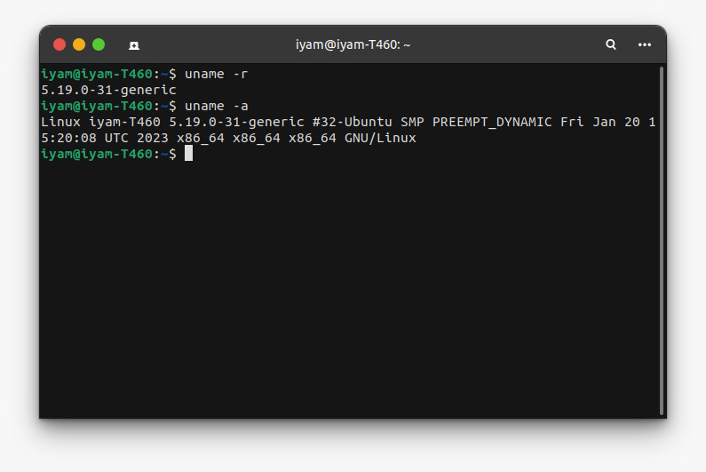
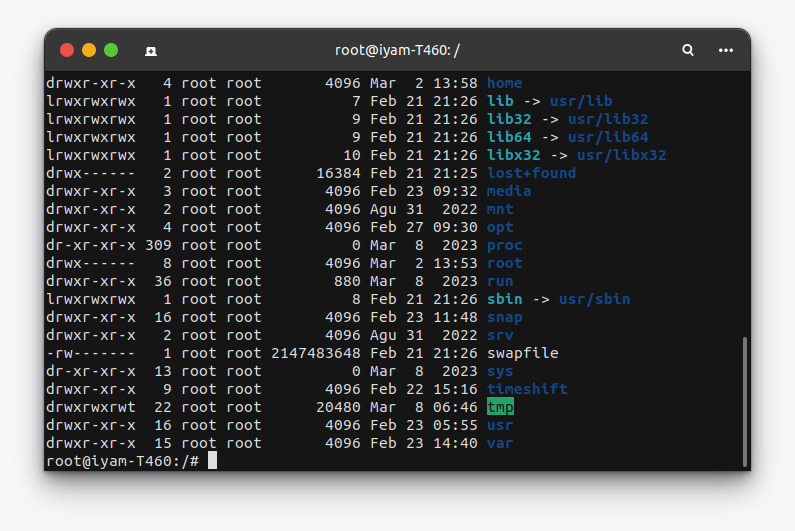
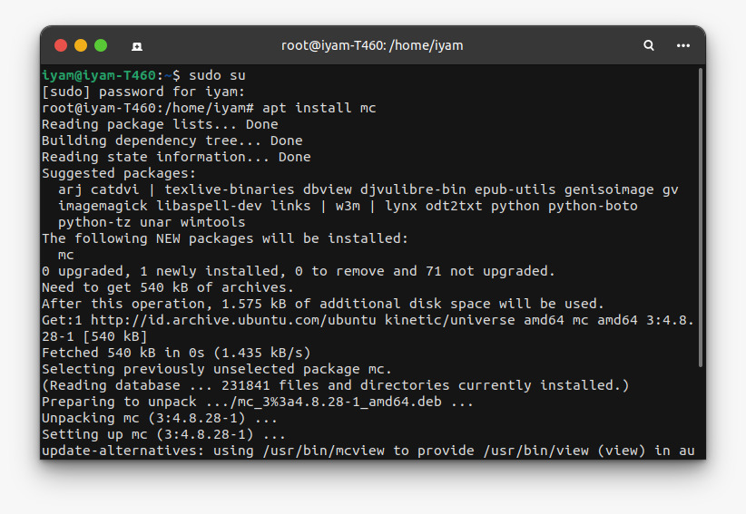
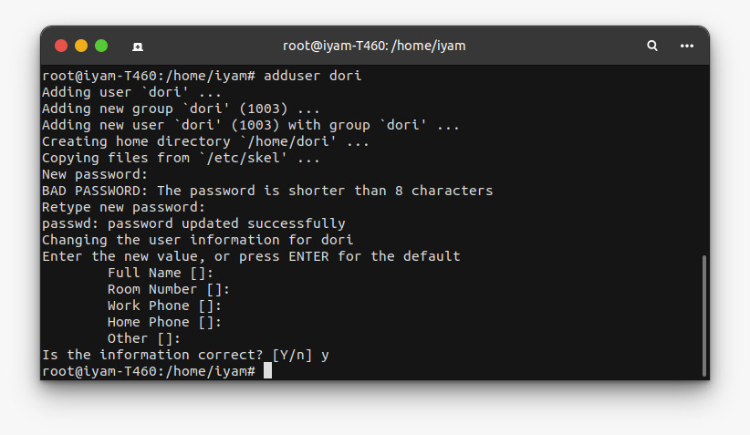
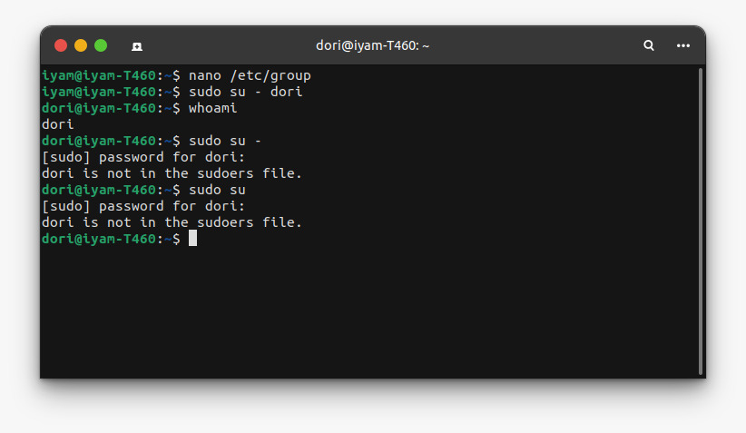
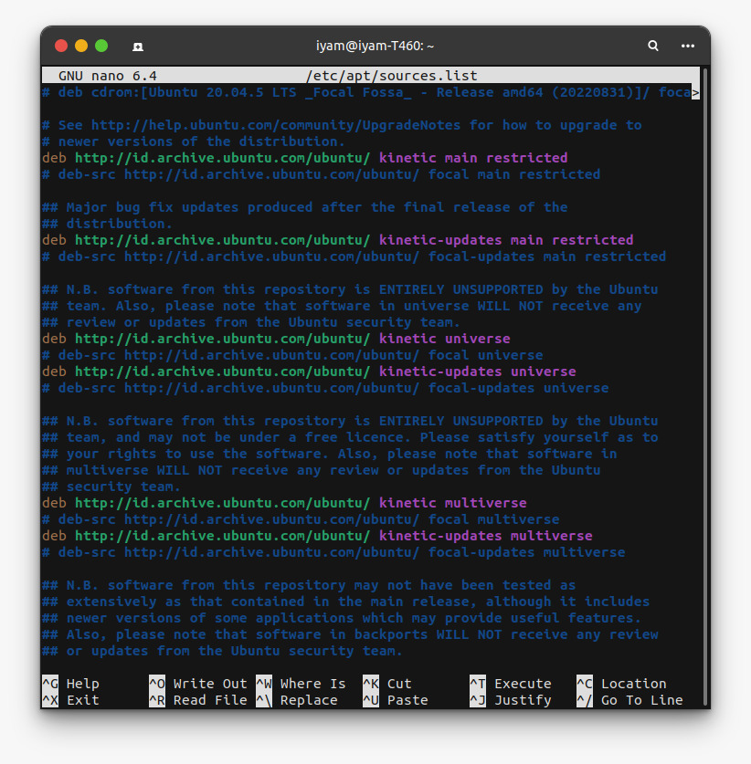
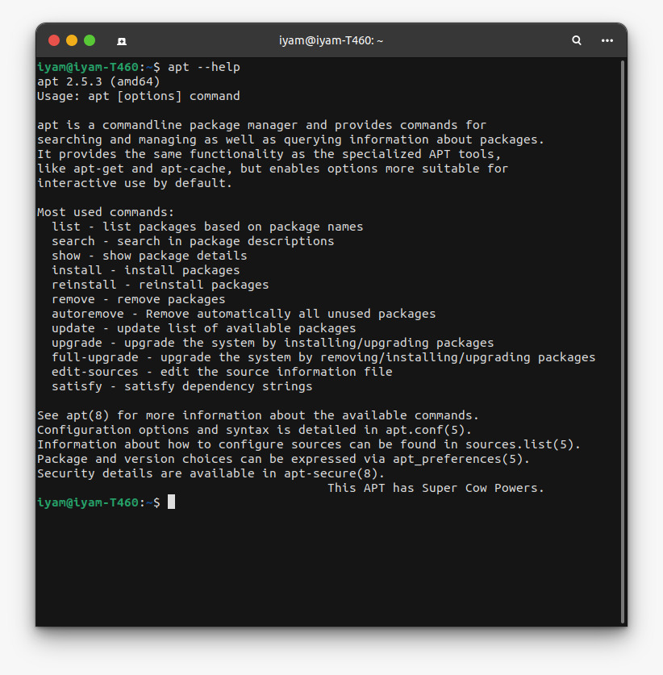

<p align="center"></p>

| Kategori | Isi |
| -------- | --- |
| Nama | Muhammad Ilham Adi Pratama |
| NRP  | 3121600014 |
| Kelas| 2 D4 IT A |
| Dosen| Dr. Ferry Astika Saputra ST, M.Sc.|

# Tugas Identifikasi

## 1. Identifikasi Kernel



Kernel adalah bagian inti dari sistem operasi Linux atau Unix yang bertanggung jawab untuk mengelola sumber daya komputer, seperti memori, prosesor, dan perangkat keras lainnya. Kernel adalah komponen penting pada sistem operasi Linux karena berfungsi sebagai perantara antara aplikasi dan perangkat keras.

```
uname -a 
```

perintah diatas untuk menampilkan semua informasi tentang sistem seperti nama host, versi kernel, arsitektur sistem, platform sistem operasi, tanggal dan waktu kompilasi kernel, dll.

```
uname -r 
```

perintah diatas hanya menampilkan nomor versi kernel yang sedang berjalan pada sistem.

### Penjelasan Kernel

Dalam versi kernel saya5.19.0.31, ini menunjukkan versi kernel Ubuntu yang digunakan. Versi kernel ini adalah 5.19.0.31, di mana:

5 adalah nomor utama kernel, yang menunjukkan bahwa ini adalah kernel seri 5.

19 adalah nomor minor kernel, yang menunjukkan bahwa ini adalah kernel seri 19 dari seri 5.

0 adalah nomor revisi kernel, yang menunjukkan bahwa ini adalah revisi pertama dari kernel seri 19.

31 adalah nomor pembangunan kernel, yang menunjukkan bahwa ini adalah build ke-31 dari revisi pertama dari kernel seri 19.

## 2. Identifikasi directory structure



**/usr** menyimpan program dan data yang terkait dengan pengguna. 
**/bin** execute table file semua user bisa 
**/sbin** execute table file untuk super user
**/root** menyimpan file konfigurasi, skrip shell, dan data lainnya yang berkaitan dengan pengguna root.
**/home** menyimpan semua file dan data pribadi pengguna, seperti file dokumen, gambar, musik, dan video.
**/var** untuk data data folatil berubah rubah seperti log sistem
**/temp** penyimpanan sementara 
**/etc** untuk konfigurasi
**/opt** untuk aplikasi aplikasi  optional
**/mnt** digunakan untuk memuat sistem file dari file sistem lain.

## 3. Identifikasi perbedaan sudo dan su

```
su
```

"su" (atau "switch user") digunakan untuk mengubah identitas pengguna menjadi akun superuser atau akun lain, sementara "sudo" (atau "superuser do") digunakan untuk menjalankan perintah tertentu sebagai akun superuser atau akun lain tanpa perlu masuk ke dalam akun superuser secara langsung.

Saat menggunakan perintah "su", pengguna harus memasukkan kata sandi untuk akun superuser atau akun lain yang dituju. Namun, saat menggunakan perintah "sudo", pengguna diminta untuk memasukkan kata sandi mereka sendiri untuk memverifikasi identitas mereka sebelum menjalankan perintah.

```
sudo
```
Penggunaan "sudo" lebih aman daripada "su" karena tidak memerlukan pengguna untuk masuk ke dalam akun superuser secara langsung. Ini membatasi potensi kerusakan atau kesalahan yang dapat terjadi saat menggunakan akses superuser.sudo su untuk folder saat ini

```
sudo su -
```

super user ke home

```
sudo su
```

akan ke root



```
nano /etc/sudoers.tmp
```





## 4. Identifikasi jenis repository

```
nano /etc/apt/sources.list
```



Ini adalah file sources.list Ubuntu yang berisi beberapa jenis repository. Berikut adalah identifikasi jenis repository berdasarkan baris yang dimulai dengan "deb" :

**deb cdrom**: - Ini adalah repository dari CD/DVD instalasi Ubuntu.

**deb <http://id.archive.ubuntu.com/ubuntu/> kinetic main restricted** - adalah repository utama (main) Ubuntu, yang berisi paket-paket utama untuk sistem operasi Ubuntu.

**deb <http://id.archive.ubuntu.com/ubuntu/> kinetic-updates main restricted** - Ini adalah repository Ubuntu untuk pembaruan (updates) dari paket-paket di repository utama.

**deb <http://id.archive.ubuntu.com/ubuntu/> kinetic universe** - adalah repository Ubuntu untuk paket-paket yang tidak disupport secara resmi oleh Ubuntu, namun tetap terbuka untuk diakses oleh pengguna.

**deb <http://security.ubuntu.com/ubuntu> kinetic-security multiverse** - adalah repository Ubuntu untuk pembaruan keamanan (security) dari paket-paket di repository multiverse.

**deb <http://security.ubuntu.com/ubuntu> kinetic-security universe** - Ini adalah repository Ubuntu untuk pembaruan keamanan (security) dari paket-paket di repository universe.
**deb <http://security.ubuntu.com/ubuntu> kinetic-security main restricted** - Ini adalah repository Ubuntu untuk pembaruan keamanan (security) dari paket-paket di repository utama.

## 5. Identifikasi perintah apt

```
apt --help
```



apt update : Memperbarui daftar paket dan metadata yang tersedia di repository.

apt upgrade : Menginstall paket-paket baru yang tersedia dan mengupgrade paket yang sudah terinstall.

apt install : Menginstall paket baru.

apt remove : Menghapus paket yang sudah terinstall.

apt autoremove : Menghapus paket-paket yang tidak lagi dibutuhkan oleh sistem.

apt search : Mencari paket yang tersedia di repository.

apt show : Menampilkan informasi detail tentang paket yang tersedia di repository.

apt list : Menampilkan daftar paket yang sudah terinstall.

apt full-upgrade : Menginstall paket-paket baru dan mengupgrade paket-paket yang sudah terinstall dengan menyelesaikan semua ketergantungan (dependencies) yang dibutuhkan.

list - menampilkan daftar paket berdasarkan nama paket 

search - mencari dalam deskripsi paket 

show - menampilkan detail paket

install - menginstall paket 

reinstall - menginstall ulang paket 

remove - menghapus paket 

autoremove - menghapus otomatis semua paket yang tidak terpakai 

update - memperbarui daftar paket yang tersedia 

upgrade - mengupgrade sistem dengan menginstal/mengupgrade paket-paket 

full-upgrade - mengupgrade sistem dengan menghapus/menginstal/mengupgrade paket-paket 

edit-sources - mengedit file informasi sumber

satisfy - memenuhi string dependensi