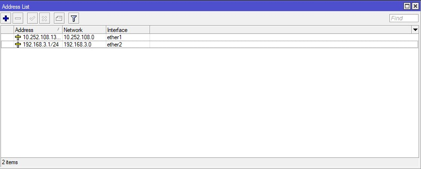
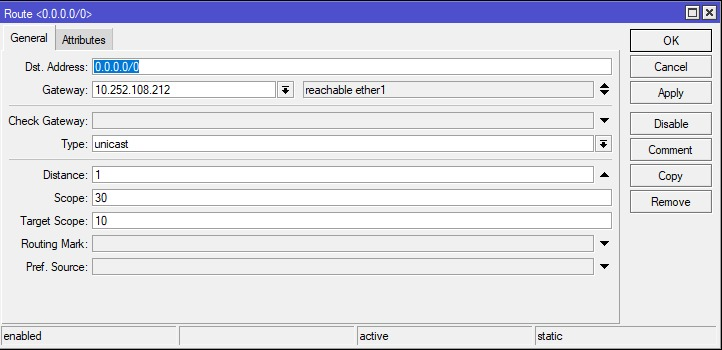
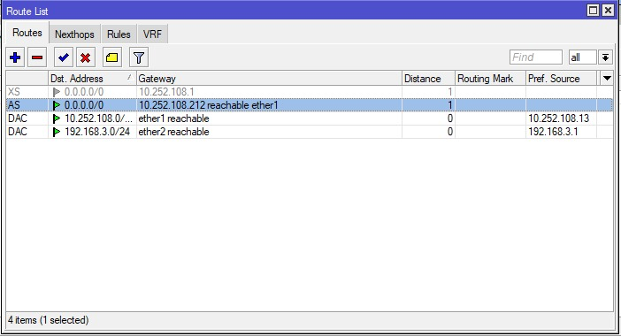
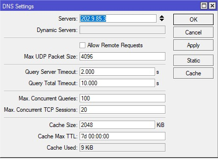
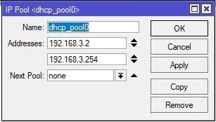
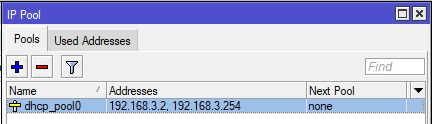
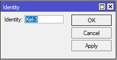

<p align="center"></p>

| Kategori | Isi |
| -------- | --- |
| Nama | Muhammad Ilham Adi Pratama |
| NRP  | 3121600014 |
| Kelompok | 3 |
| Kelas| 2 D4 IT A |
| Dosen| Dr. Ferry Astika Saputra ST, M.Sc.|

### Backlog Minggu Kedua

- [Konfigurasi Router](#konfigurasi-router)
  - [Reset Router](#reset-router)
  - [Konfigurasi](#konfigurasi)
    - [IP Public](#ip-public)
    - [IP Local](#ip-local)
    - [Default Route](#default-route)
    - [DNS](#dns)
    - [Internet Client](#internet-client)
    - [Dan berikut konfigurasi lengkapnya](#dan-berikut-konfigurasi-lengkapnya)


# Konfigurasi Router

## Reset Router

Pertama adalah me-_reset_ router agar konfigurasi pada router dikembalikan ke konfigurasi pabrik. Untuk reset router, bisa menggunakan perintah dibawah pada **Terminal** winbox

```console
/system
reset-configuration no-defaults=yes skip-backup=yes
```

## Konfigurasi

### IP Public

Untuk menambah _config_ untuk IP public, kita bisa menggunakan perintah berikut untuk mengatur port `ether1` untuk _public_



### IP Local

Untuk menambah _config_ untuk IP lokal, kita bisa menggunakan perintah berikut untuk mengatur port `ether2` untuk lokal


### Default Route

Untuk default route, atur menggunakan 





### DNS

untuk mengatur DNS pada router




### Internet Client

Untuk _config client_, config yang diterapkan hanya DHCP server karena _client_ hanya tinggal IP nya saja menggunakan perintah

```console
/ip pool
add name=dhcp_pool0 ranges=192.168.3.2-192.168.3.254
/ip dhcp-server network
add address=192.168.3.0/24 gateway=192.168.3.1
/ip dhcp-server
add address-pool=dhcp_pool0 disabled=no interface=ether2 name=dhcp1
```






### Dan berikut konfigurasi lengkapnya

```console
# mar/10/2023 07:46:55 by RouterOS 6.39.3
# software id = SSDE-WU5D
#
/interface wireless security-profiles
set [ find default=yes ] supplicant-identity=MikroTik
/ip pool
add name=dhcp_pool0 ranges=192.168.3.2-192.168.3.254
/ip dhcp-server
add address-pool=dhcp_pool0 disabled=no interface=ether2 name=dhcp1
/ip address
add address=10.252.108.15/24 interface=ether1 network=10.252.108.0
add address=192.168.3.1/24 interface=ether2 network=192.168.3.0
/ip dhcp-server network
add address=192.168.3.0/24 gateway=192.168.3.1
/ip dns
set servers=202.9.85.3
/ip firewall nat
add action=masquerade chain=srcnat out-interface=ether1
/ip route
add distance=1 gateway=10.252.108.212
/system identity
set name=Kel-3
```



[def]: #backlog-minggu-kedua