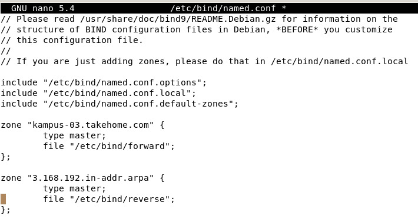
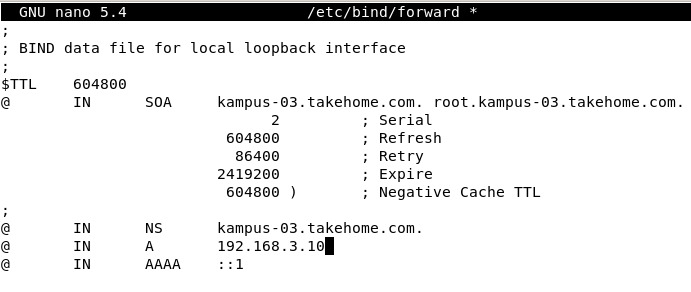
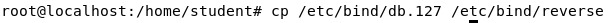
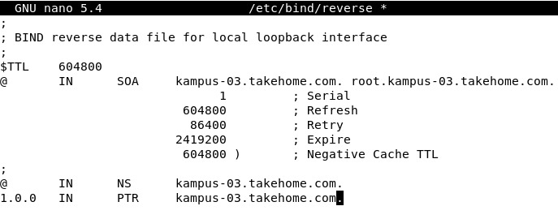
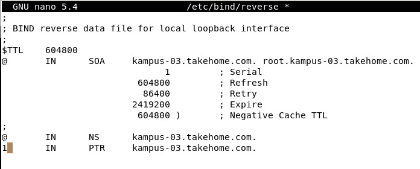
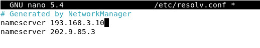
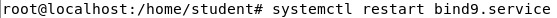
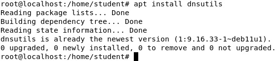

| Kategori | Isi |
| -------- | --- |
| Nama | Muhammad Ilham Adi Pratama |
| NRP  | 3121600014 |
| Kelas| 2 D4 IT A |
| Dosen| Dr. Ferry Astika Saputra ST, M.Sc.|

# KONFIGURASI DNS SERVER

Lakukan konfigurasi pada file-file berikut ini:
1. Membuat domain dari server linux dengan menggunakan TLD (Top Level Domain). TLD ini hanya berfungsi pada jaringan lokal saja. Langkahnya adalah dengan mengkonfigurasi file named.conf yang terdapat pada direktori /etc/bind. File ini berfungsi sebagai informasi zona dan direkori file forward dan reserve. Perintahnya adalah :

        dengan perintah: home/sis# nano /etc/bind/named.conf
        
    Jika sudah berada di editor silahkan tambahkan sesuai dengan tanda merah seperti di bawah ini, jangan lupa di simpan hasil menambahkan dengan perintah ctrl+o dan ctrl+x untuk keluar. 
    
    
    File forward berfungsi untuk mengkonversi alamat domain ke alamat IP, sedangkan file reverse berlaku sebaliknya yaitu mengkonversi alamat IP server ke domain.
    
2. Buatlah file forward dengan cara mengcopy file db.local yang terletak pada direktori /etc/bind:

    
    Buka file forward:
    
        dengan perintah: nano /etc/bin/forward
    
    Ganti localhost dengan hostname “smkn1pacitan.net” seperti yang sudah di buat sebelumnya, sehingga menjadi seperti berikut:
    
    
    ganti juga IP dengan IP Address Server kita.

3. Selanjutnya membuat file reserve dengan cara mengcopy file db.127 pada direktori yang sama dengan forward:

    
    Konfigurasi file reverse dengan mengetikkan perintah berikut:
    
        dengan perintah: home/sis# nano /etc/bind/reverse
    
    Ganti localhost dengan alamat hostname seperti file forward di atas:

    
    Ganti juga alamat IP 1.0.0 dengan IP Oktet terakhir IP Debian kita.
    
    
    
4. Tambahkan DNS nameserver dari server linux pada file resolv.conf dengan perintah berikut:

        dengan perintah: /home/sis# nano /etc/resolv.conf
    
    Pastikan nameserver (IP Address Server Debian )berada pada baris pertama.
    
    
    
5. Restart layanan DNS server seperti perintah sebelumnya:

    
    
    PENGUJIAN DNS SERVER
    
    Test apakah DNS Server tersebut berhasil atau tidak, dengan perintah ping maupun nslookup dari computer server.

    Install terlebih dahulu layanan dnsutils dengan perintah:
    
    
    
    Lakukan pengujian dengan melakukan perintah berikut:
    
        dengan perintah: /home/sis# nslookup takehome.net
    
    Lakukan juga pengujian dengna cara mengetikkan perintah berikut:
    
        /home/sis# nslookup 192.168.1.1
    
    Pengujian pada komputer client dapat dilakukan dengan cara memasukkan alamat domain pada url bar browser atau dengan menggunakan utilitas ping.

    Demikian pembahasan singkat terkait dengan konfigurasi DNS server pada distro Linux Debian 

Untuk dokumentasi cara konfigurasi dapat dilihat [Here](https://drive.google.com/file/d/1zYc9UAdQtFJfjQqx_onJxPBqFKj8q1wC/view?usp=sharing)